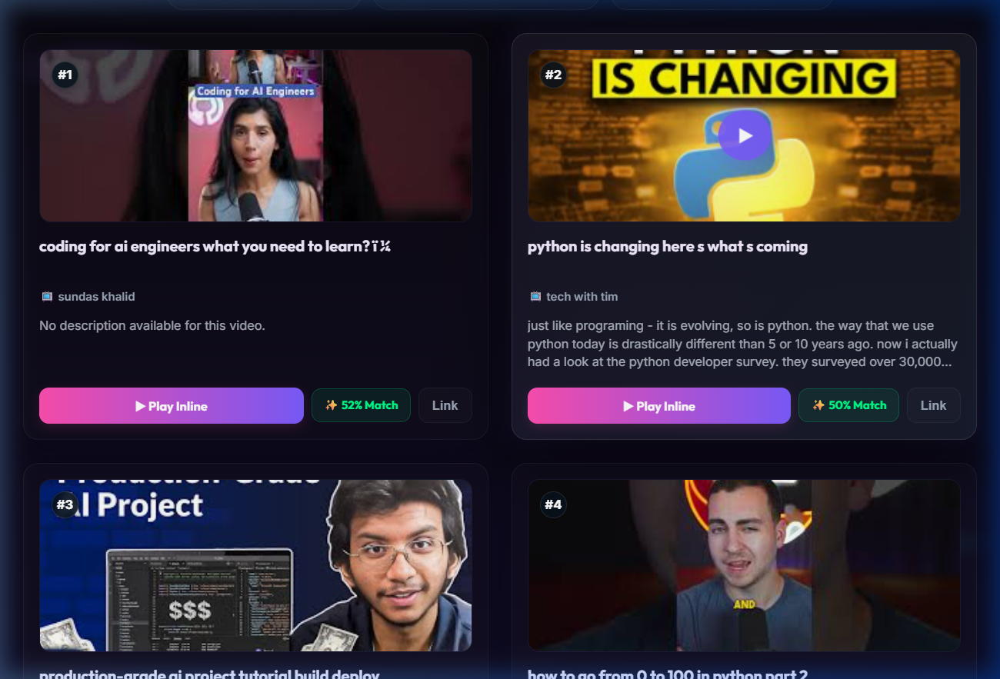

# 🧠 QueryTube - Premium AI Semantic Search


> 🚀 A premium semantic search engine that finds **YouTube videos by their true meaning**, not just keywords. Powered by AI Sentence Transformers, ChromaDB, and FastAPI, featuring a stunning glassmorphism UI.

---

## 🌐 Live Demo
- **Frontend Dashboard:** [https://Satyaprakash7325.github.io/QueryTube/frontened/index.html](https://Satyaprakash7325.github.io/QueryTube/frontened/index.html)
- **Backend API:** Hosted live on Hugging Face Spaces `https://Satya73-querytube-api.hf.space`

## 🌟 Premium Features

- 🎯 **True Semantic Search:** Understands the underlying *meaning* of your search, not just exact word matches.
- 🎨 **Glassmorphism UI:** A custom-designed, dark-themed premium dashboard with dynamic neon ambient lighting.
- 🎛️ **Advanced Diversity Filters:** Control "Channel Dominance" by selecting **Strict (Max 1 video per channel)** or **Moderate** filtering to discover a diverse range of creators.
- ✨ **Intuitive Match Scores:** Automatically converts raw ChromaDB cosine distances into a highly intuitive `0% to 100% Match` percentage.
- 📺 **Interactive Inline Player:** Click any video card to launch an instant popup modal to play the YouTube video directly inside the app without leaving the page.
- 🧠 **Transformer Embeddings:** Uses `all-MiniLM-L6-v2` for precise vector encoding.
- ⚡ **FastAPI Backend:** Blazing fast API bridging the frontend UI with the ChromaDB vector storage.

---

## 🖼️ Dashboard Preview



*(A screenshot showing the dynamic match percentages, channel diversity controls, and interactive glassmorphism UI).*

---

## ⚙️ Tech Stack

| Component | Technology |
|------------|-------------|
| **Backend API** | FastAPI (Python) |
| **Vector Database** | ChromaDB |
| **AI Embedding Model** | SentenceTransformer (`all-MiniLM-L6-v2`) |
| **Frontend UI** | Vanilla HTML, CSS (Glassmorphism), JavaScript |
| **Deployment** | GitHub Pages (Frontend) & Hugging Face Spaces (Backend) |

---

## 🧩 Local Setup & Installation

If you want to run this locally on your own machine:

### 1️⃣ Clone Repository
```bash
git clone https://github.com/Satyaprakash7325/QueryTube.git
cd QueryTube
```

### 2️⃣ Create Virtual Environment & Install
```bash
python -m venv venv
venv\Scripts\activate          # Windows
source venv/bin/activate       # macOS/Linux

pip install -r requirements.txt
```

### 3️⃣ Run the Backend Server
```bash
uvicorn src.main:app --reload --port 8000
```

### 4️⃣ Launch the Frontend
Open `frontened/index.html` via VS Code Live Server or a simple HTTP server to start searching!

---

## 💡 How It Works

1. **Embedding Phase (`src/embed_data.py`)**  
   The system loads the YouTube transcript dataset, cleans the data, and generates highly accurate semantic vector embeddings using the `SentenceTransformer` model, storing them into the local **ChromaDB**.

2. **Search Phase (`src/main.py`)**  
   The FastAPI server intercepts user searches, converts the query text into a semantic vector in real-time, and performs a rapid Cosine Distance similarity check against the ChromaDB storage.

3. **Client-Side Rendering (`frontened/script.js`)**  
   The frontend receives the matches, instantly converts the distance scores into user-friendly Match Percentages, applies Channel Diversity filtering (to prevent one channel from spamming the results), and dynamically renders the stunning UI.

---

## 🧾 License & Support

This project is open-source. If you found it helpful or inspiring:
- Star ⭐ the repository!
- Feel free to Fork and contribute!
